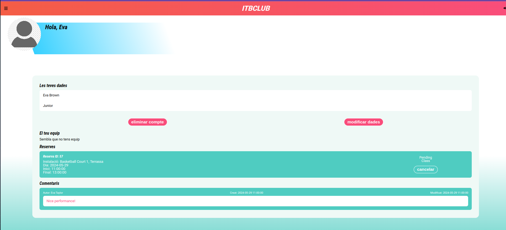

# Club Esportiu ITB Club - README

## Taula de continguts:
1. [Informació General](#general-info)
2. [Tecnologies](#technologies)
3. [Instal·lació](#installation)
4. [Autors](#collaboration)
## Descripció del Projecte <a name="general-info"></a>

Aquest projecte és una aplicació web per a la gestió d'un club esportiu. 
L'aplicació permet als usuaris consultar la informació general del club i tenen accés a funcionalitats adicionals com lloguers de pista i gestionar
equips, tornejos i classes. 
A més, permet al personal del club i als administradors gestionar reserves, tornejos, rànquings i molt més.

### Home
>
### Informació general:
>
>
- Instal·lacions:
  
>
- Clubs:
  
>
- Tornejos del club:
  
>

## Funcionalitats d'Usuari:

### Usuari No Registrat
- Consultar informació general del club.
- Consultar tornejos i equips (sense informació detallada dels membres).

### Usuari Registrat
- Accedir a informació detallada del club, tornejos i equips.
- Veure el rànquing.
- Crear un equip o unir-se a un equip.
- Veure informació detallada del seu equip.
- Reservar una pista per fer una classe.
- Consultar comentaris

### Capità d'Equip
- Apuntar-se a tornejos.
- Fer reserves de classes.
- Veure informació detallada del seu equip.
- Reservar una pista per fer una classe.

### Administrador
- Accedir a tota la informació de la web.
- Crear i gestionar tornejos.
- Gestionar equips.
- Veure i modificar el rànquing.

### Equips
- Els equips estan formats per jugadors i un capità (usuari que ha creat l’equip).

## Funcionalitats Principals:

### Reserva de pistes
- Lloger de pistes per entrenaments, partits, tornejos...
>

### Comentaris
- L'entrenador pot afegir comentaris sobre una classe.
- L'usuari pot consultar els seus comentaris.

### Jugadors
- Logar-se.
- Alta, baixa i modificació de la informació dels jugadors.
- Llistat de jugadors segons puntuació.
- Rànquing calculat segons resultats en tornejos.

>
>
>
>

### Tornejos
- Alta de tornejos.
- Assignar jugadors/equips al torneig.
- Classificació dels equips dins del torneig.

>

### Partits
- Alta de partits.
- Tipus de partits: amistós i de torneig.


### Consultar el Rànquing
- Estadístiques de cada equip (punts a favor, punts en contra, victòries/derrotes).
- Puntuació reflectida al rànquing general.

>

### Classes Particulars
- Fitxa del jugador amb comentaris.
- Reservar classe particular.
- Reservar pista per les classes.

## Estructura de la Base de Dades

La base de dades està estructurada per donar suport a les funcionalitats mencionades. Inclou les següents taules principals:

1. **Persones**: Informació de tots els usuaris registrats.
2. **Equips**: Informació dels equips i els seus membres.
3. **Tornejos**: Informació dels tornejos.
4. **Partits**: Informació dels partits, participants, tipus i estadístiques.
5. **Pistes**: Tipus de pistes del club.
6. **Comentaris**: Comentaris de l'entrenador en les classes particulars.
7. **Reserves**: Reserva de pistes i classes particulars.
8. **Pagaments**: Pagaments de les reserves.
9. **Seus**: Localització de les seus de l'ITB club.

## Instal·lació i Configuració

1. Cloneu el repositori:
   ```sh
   git clone <https://github.com/SerraSilvia/gestio_basquet.git>

   A little intro about the installation. 
```
$ git clone https://example.com
$ cd ../path/to/the/file
$ npm install
$ npm start

# Technologies
***
A list of technologies used within the project:
* [JavaScript](https://developer.mozilla.org/es/docs/Web/JavaScript)
* [Vue 3](https://es.vuejs.org/v2/guide/)
* [PHP](https://www.php.net/manual/es/index.php)
* [Axios](https://axios-http.com/es/docs/intro)
* [GitHub](https://docs.github.com/es)
* [Docker](https://docs.docker.com/)
* [AWS](https://docs.aws.amazon.com/es_es/)

## Collaboration
***

## Collaboration
***
Give instructions on how to collaborate with your project.
> Maybe you want to write a quote in this part. 
> It should go over several rows?
> This is how you do it.
